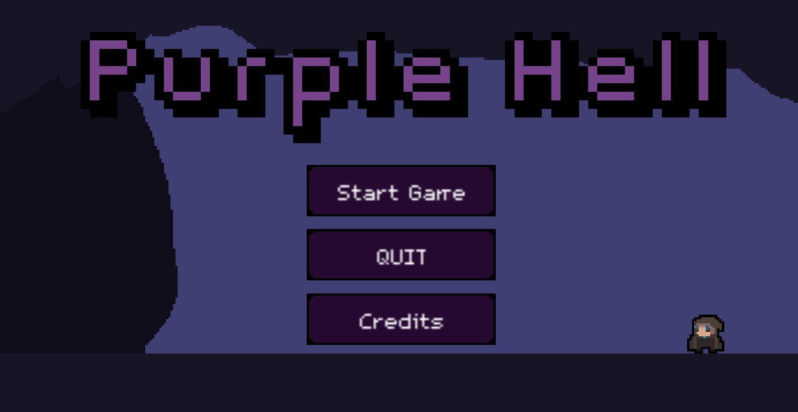

# In Development

# [PurpleHell](https://github.com/fabriciovo/PurpleHell)
This game was made for college, your intention is use all kind of data structures Linked Lists, Stacks, Queues, etc. 

## About
C++/SFML based game. It's a simple Turn Based RPG. Your objective is survives in wave of enemies.

## Built With
*  C/C++
* SFML

## App
* ItchIO Download: https://fabriciovarisco.itch.io/purplehell

## Credits

- [Fabricio Varisco Oliveira](https://github.com/fabriciovo)

